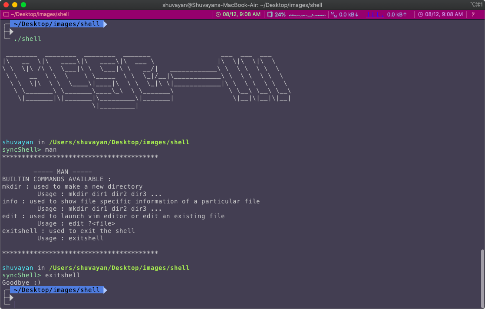

# OS LAB ASSIGNMENTS

This repo contains the os lab assignments given as a part of the JU-CSE course work.

The first assignment contains knowing of bash scripts and their implementation for performing 
various tasks.

It has a implementation of a C -based job-control shell.

	

